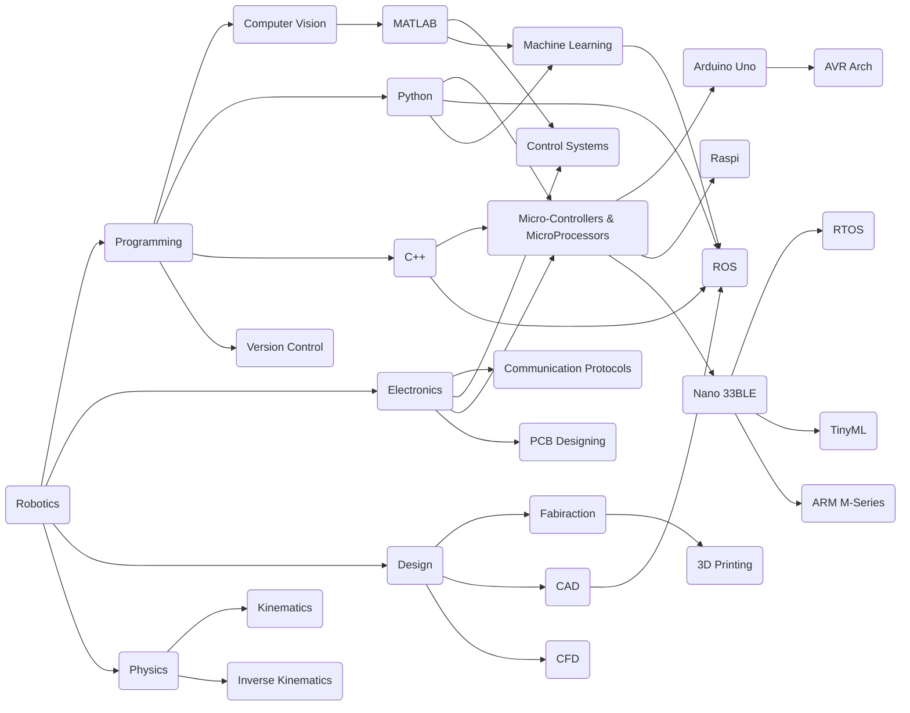

# Introduction

```mermaid
graph LR;
        id1(Robotics)-->id2(Programming)
        id1(Robotics)-->id3(Electronics)
        id1(Robotics)-->id4(Design)
        
        id4(Design)-->id5(Fabiraction)
        id4(Design)-->id6(CAD)
        id4(Design)-->id7(CFD)
        
        id1(Robotics)-->id27(Physics)
        id27(Physics)-->id28(Kinematics)
        id27(Physics)-->id29(Inverse Kinematics)
  
    id2(Programming)-->id14(Computer Vision)
        id2(Programming)-->id20(Python)
        id2(Programming)-->id21(C++)
        id20(Python)-->id10(Micro-Controllers & MicroProcessors)
        id21(C++)-->id10(Micro-Controllers & MicroProcessors)
        id14(Computer Vision)-->id15(MATLAB)
        id15(MATLAB)-->id8(Control Systems)
        id12(Nano 33BLE)-->id18(RTOS)
        id12(Nano 33BLE)-->id17(TinyML)
        id12(Nano 33BLE)-->id19(ARM M-Series)
        id2(Programming)-->id22(Version Control)
    
                id3(Electronics)-->id23(Communication Protocols)
        id20(Python)-->id24(ROS)
        id21(C++)-->id24(ROS)
        id6(CAD)-->id24(ROS)
        id25(Machine Learning)-->id24(ROS)
        id20(Python)-->id25(Machine Learning)
        id15(MATLAB)-->id25(Machine Learning)
        id5(Fabiraction)-->id26(3D Printing)
       
   
        id3(Electronics)-->id8(Control Systems)
        id3(Electronics)-->id10(Micro-Controllers & MicroProcessors)
        id10(Micro-Controllers & MicroProcessors)-->id9(Arduino Uno)
        id10(Micro-Controllers & MicroProcessors)-->id11(Raspi)
        id10(Micro-Controllers & MicroProcessors)-->id12(Nano 33BLE)
        id9(Arduino Uno)-->id13(AVR Arch)
        id3(Electronics)-->id16(PCB Designing)


```